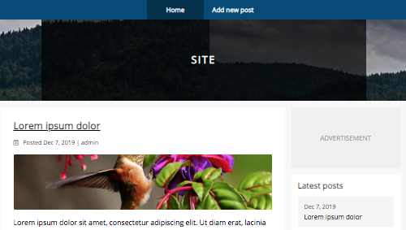

# Django - The Easy Way (3rd Edition)

<h4>[Updated 2019.12.26] Works with Django 2 and 3!</h4>

[LeanPub (Free updates)](https://leanpub.com/django-the-easy-way)

[Amazon (Kindle)](https://amzn.to/2RUzivh)

[Amazon (Paperback)](https://amzn.to/38CwCse)

## About the book

<h4>Key Features</h4>

o Beginner-friendly <b>function-based</b> approach.

o Covers all <b>essential concepts</b>.

  

## About the author

Samuli Natri is a programmer who specialises in Django, Python and JavaScript development. He attended Helsinki University of Technology (Computer Science) and Helsinki University (Social Sciences).
