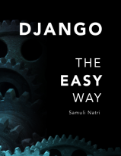

# Django - The Easy Way (3rd Edition)

<h4>[Updated 2020.03.14]</h4>

[LeanPub (Free updates)](https://leanpub.com/django-the-easy-way)

[Amazon (Kindle)](https://amzn.to/2RUzivh)

[Amazon (Paperback)](https://amzn.to/38CwCse)

## About the author

Samuli Natri is a software developer. He studied computer science at Helsinki University Of Technology.